

  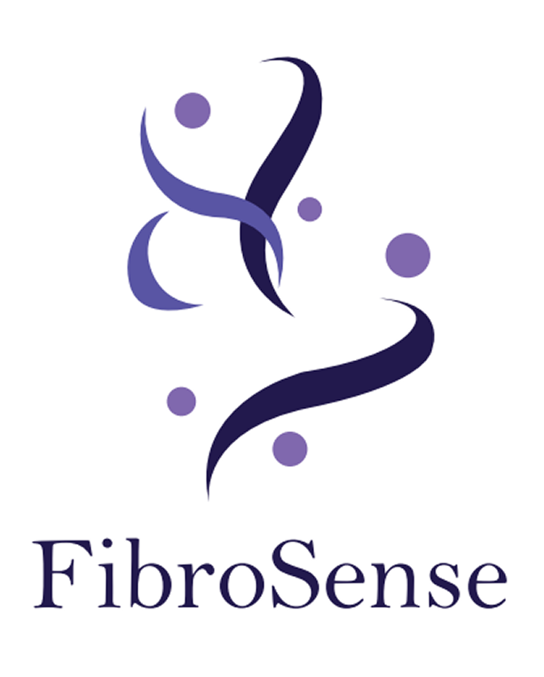

<h1 align="center">
  Bem-Vindo(a) à 
  FibroSense
</h1>

  O FibroSense é um aplicativo desenvolvido para auxiliar pessoas com fibromialgia no acompanhamento da saúde.
  Utilizando dados coletados por smartwatches, o aplicativo monitora informações importantes em tempo real,
  ajudando no controle dos sintomas, no acompanhamento diário e na melhoria da qualidade de vida dos usuários.

 

<h2>
  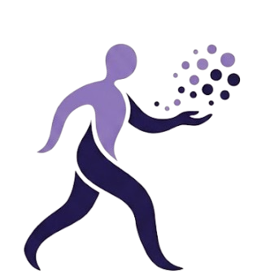
  Nossa Missão
</h2>

  Foca em ajudar essas pessoas a compreenderem melhor seus sintomas e acompanharem sua saúde no dia a dia.

<h2>
  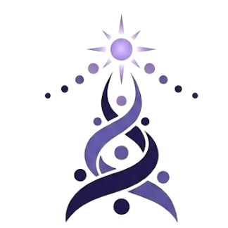
  Nossa Visão
</h2>

  Usar a tecnologia como aliada no monitoramento dessa doença unindo paciente, profissionais e companheiros.

<h2>
  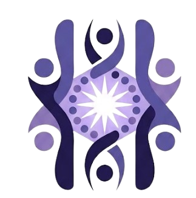
  Nossos Valores
</h2>

  Empatia, acessibilidade e cuidado humano.

<h2>
  Nosso Compromisso com os ODS
</h2>

  Apoiamos os Objetivos de Desenvolvimento Sustentável através da tecnologia, da inovação e da promoção da qualidade de vida.

  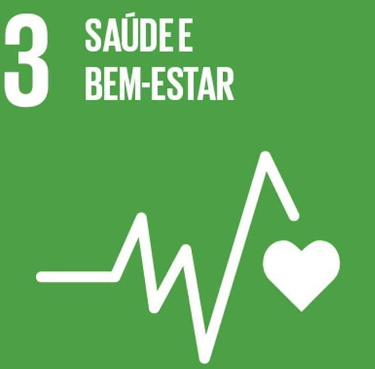
  &nbsp;&nbsp;&nbsp;
  
  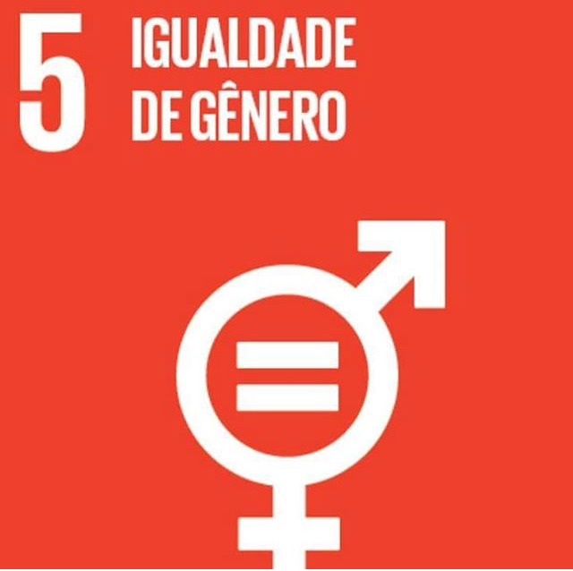
  &nbsp;&nbsp;&nbsp;

  
    &nbsp;&nbsp;&nbsp;
    
  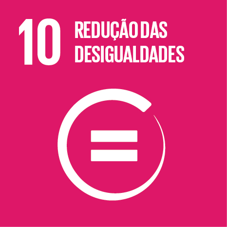

<h2>
   Funcionalidades do nosso app
</h2>

<table align="center">
  <tr>
    <td> Registro de dor</td>
    <td>Registro de humor</td>
  </tr>

  <tr>
    <td> Mapa corporal interativo</td>
    <td> Calendário de consultas</td>
  </tr>

  <tr>
    <td> Botão de emergência</td>
    <td> Monitoramento via SmartWatch</td>
  </tr>
</table>
 

  
  &nbsp;&nbsp;&nbsp;

<h2>
  Tecnologias Utilizadas
</h2>

  
  
  
  

  Kotlin &nbsp; • &nbsp;
  Jetpack Compose &nbsp; • &nbsp;
  Firebase &nbsp; • &nbsp;
  MongoDB &nbsp; • &nbsp;
  Python

<h2>
  💜 Nossa Equipe
</h2>

  Conheça as pessoas responsáveis por transformar o FibroSense em realidade.

 

<table align="center">
<tr>

<td align="center">
    

  <b>HERICK</b> 

  Product Owner  

  
</td>

<td width="45"></td>

<td align="center">
  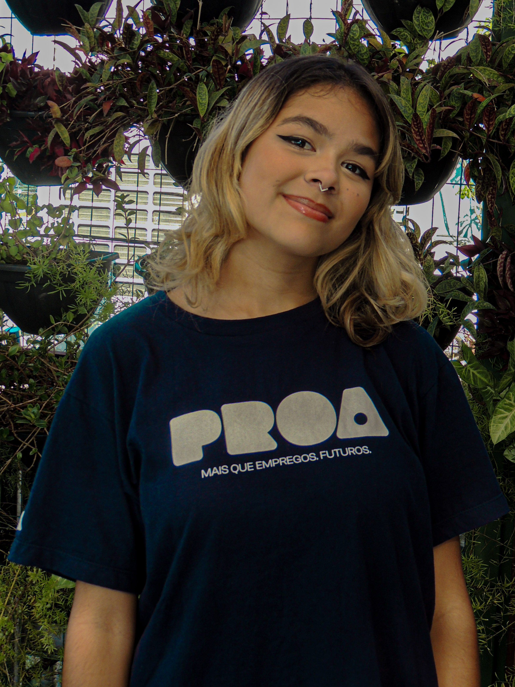  

  <b>NICKY</b> 

  Scrum Master  

  
</td>

<td width="45"></td>

<td align="center">
  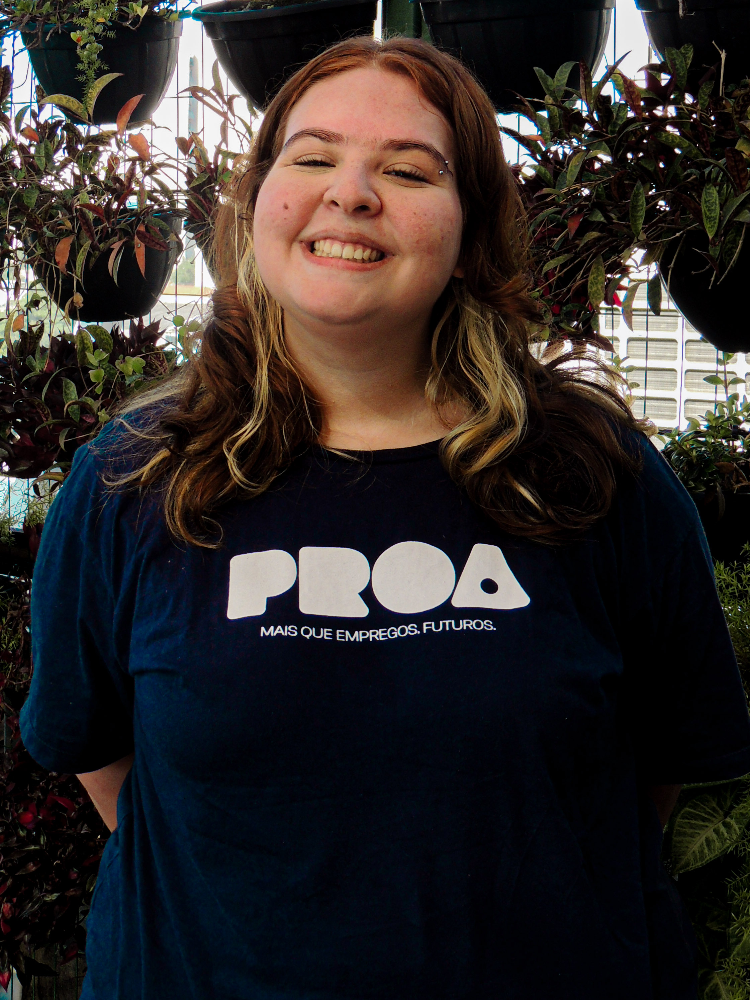  

  <b>LUIZA</b> 

  Financeiro  

  
</td>

</tr>
</table>

  

<table align="center">
<tr>

<td align="center">
  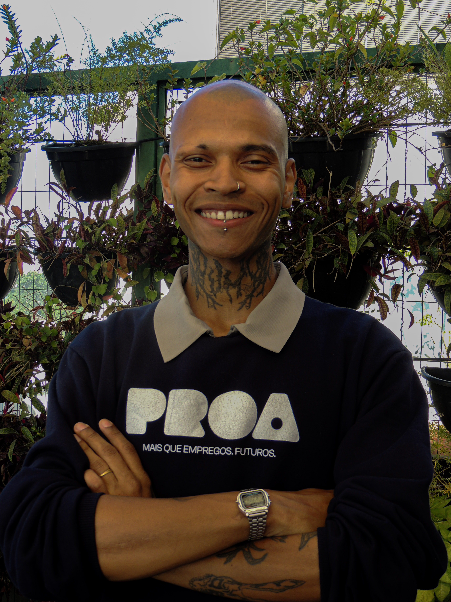  

  <b>DAVID</b> 

  UI/UX & Marketing  

  
</td>

<td width="45"></td>

<td align="center">
  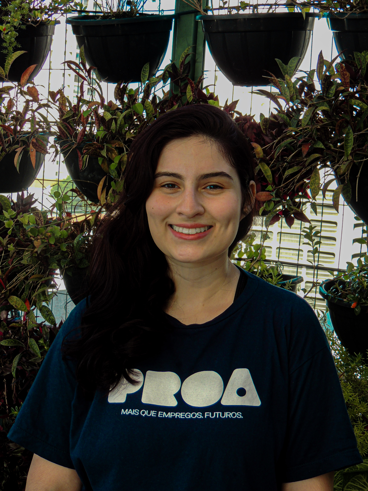  

  <b>ANA CAROLINA</b> 

  Front-End  

  
</td>

<td width="45"></td>

<td align="center">
  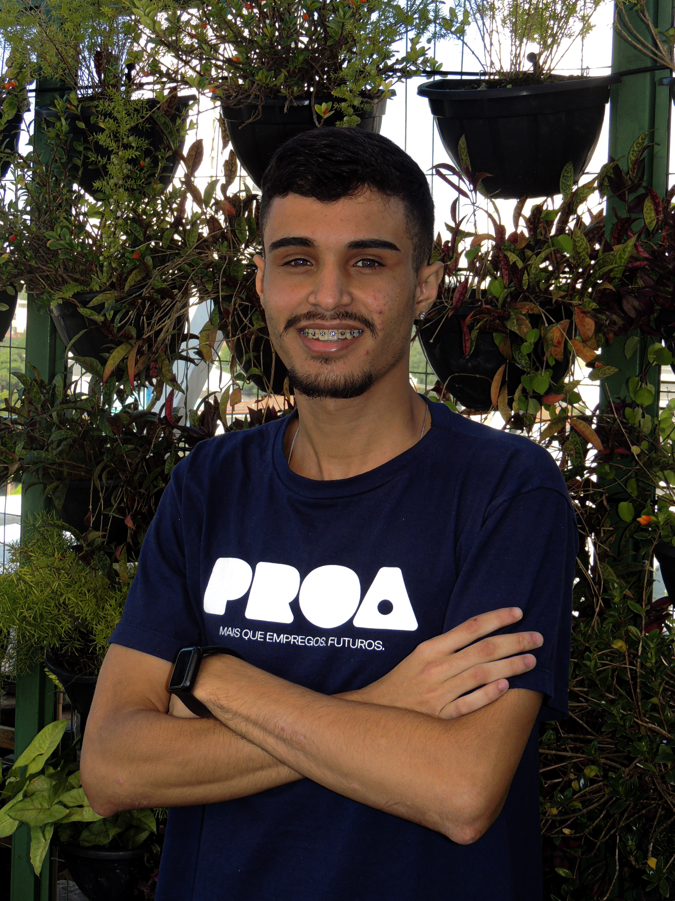  

  <b>GABRYEL</b> 

  Full Stack  

  
</td>

<td width="45"></td>

<td align="center">
  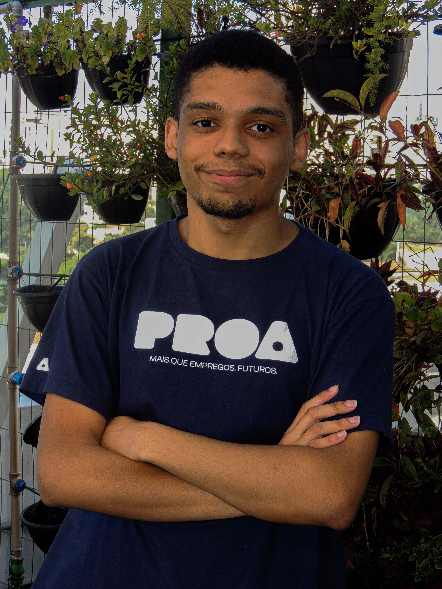  

  <b>EMANUEL</b> 

  Full Stack  

  
</td>

</tr>
</table>

<h4 align= "center">
  Você é maior que sua dor! 💜💜
</h4>
